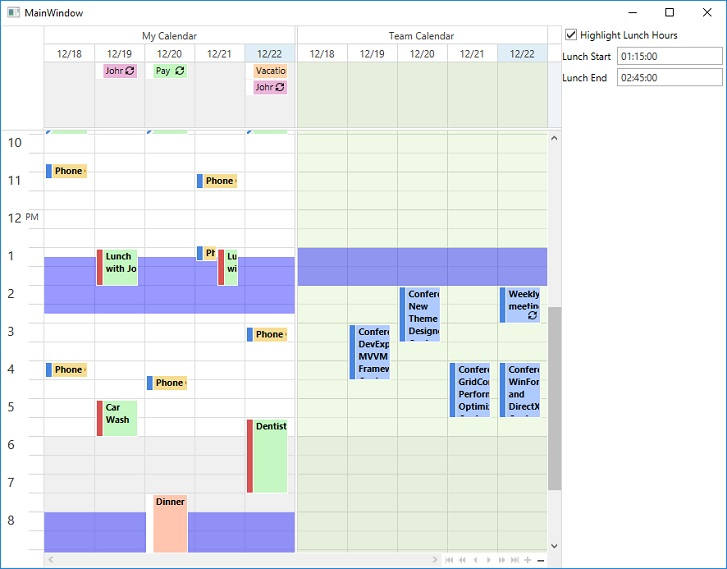

<!-- default badges list -->

[](https://supportcenter.devexpress.com/ticket/details/T590114)
[](https://docs.devexpress.com/GeneralInformation/403183)
[](#does-this-example-address-your-development-requirementsobjectives)
<!-- default badges end -->

# WPF Scheduler - Highlight Time Intervals

This example uses [Time Regions](https://docs.devexpress.com/WPF/401378/controls-and-libraries/scheduler/time-regions) to highlight time intervals with custom colors.

 

## Implementation Details

[Time Regions](https://docs.devexpress.com/WPF/401378/controls-and-libraries/scheduler/time-regions) allow you to highlight a group of cells (or their parts). To do this, define a collection of Time Region descriptors and assign this collection to the [DataSource.TimeRegionsSource](https://docs.devexpress.com/WPF/DevExpress.Xpf.Scheduling.DataSource.TimeRegionsSource) property. Use the [TimeRegionMappings](https://docs.devexpress.com/WPF/DevExpress.Xpf.Scheduling.TimeRegionMappings) object to declare mappings to properties from these descriptors:

```xaml
<dxsch:DataSource ...
                  TimeRegionsSource="{Binding TimeRegions}">
    <dxsch:DataSource.TimeRegionMappings>
        <dxsch:TimeRegionMappings Id="Id" 
                                  ResourceId="CalendarId"
                                  Start="Start"
                                  End="End"
                                  Brush="Brush"
                                  RecurrenceInfo="RecurrenceInfo"/>
    </dxsch:DataSource.TimeRegionMappings>
</dxsch:DataSource>
```

## Files to Review

* [MainWindow.xaml](./CS/SchedulerCellTemplate/MainWindow.xaml)
* [MainWindow.xaml.cs](./CS/SchedulerCellTemplate/MainWindow.xaml.cs) (VB: [MainWindow.xaml.vb](./VB/SchedulerCellTemplate/MainWindow.xaml.vb))
* [TeamData.cs](./CS/SchedulerCellTemplate/TeamData.cs) (VB: [TeamData.vb](./VB/SchedulerCellTemplate/TeamData.vb))

## Documentation

* [Time Regions](https://docs.devexpress.com/WPF/401378/controls-and-libraries/scheduler/time-regions)
* [TimeRegionMappings](https://docs.devexpress.com/WPF/DevExpress.Xpf.Scheduling.TimeRegionMappings)

## More Examples

* [WPF Scheduler - Customize Cell Colors](https://github.com/DevExpress-Examples/wpf-scheduler-customize-cell-colors)
* [WPF Scheduler - Disable Resource Colorization](https://github.com/DevExpress-Examples/wpf-scheduler-disable-resource-colorization)
* [WPF Scheduler - Filter Time Regions](https://github.com/DevExpress-Examples/wpf-scheduler-filter-time-regions)
<!-- feedback -->
## Does this example address your development requirements/objectives?

[](https://www.devexpress.com/support/examples/survey.xml?utm_source=github&utm_campaign=wpf-scheduler-highlight-time-intervals&~~~was_helpful=yes) [](https://www.devexpress.com/support/examples/survey.xml?utm_source=github&utm_campaign=wpf-scheduler-highlight-time-intervals&~~~was_helpful=no)

(you will be redirected to DevExpress.com to submit your response)
<!-- feedback end -->
